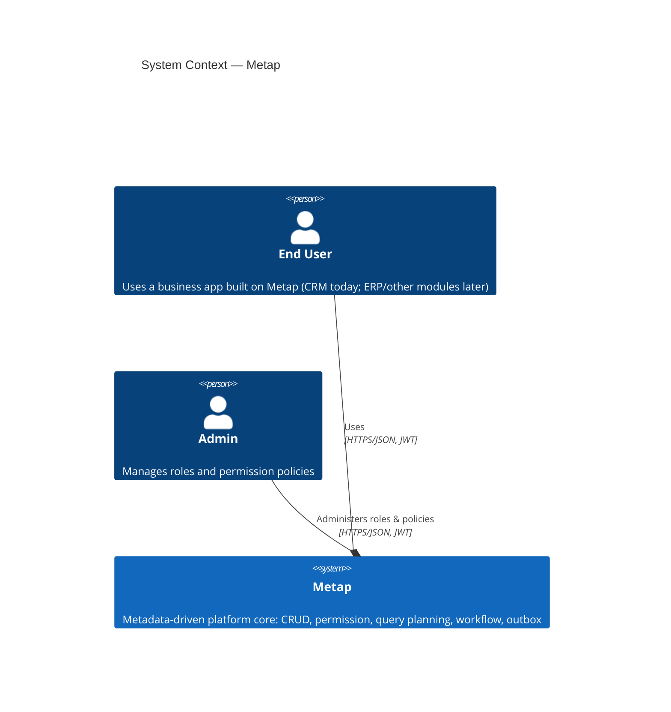

# 3. Phạm vi và Context Hệ thống

## Context Nghiệp vụ

| Actor | Tương tác |
|---|---|
| End User | Sử dụng một business app xây dựng trên Metap (CRM hiện tại) — tạo/đọc/cập nhật records, list/filter/search, thực hiện workflow transitions |
| Admin | Grant/revoke role cho từng user, quản lý các permission policy ở cấp field và record, thông qua các admin-gated HTTP route `/admin/*` (`crates/metap-http/src/routes/admin.rs`) |

Ngoài phạm vi hiện tại: chưa có tích hợp hệ thống bên ngoài nào (không có payment gateway, không có email/notification provider, không có third-party identity provider). Auth là local username/password (`docs/roadmap.md` Phase 15, từ 2026-08-09) — `POST /auth/login` verify với bảng `users` và tự mint một JWT; không có external IdP/OIDC federation.

## C4 Level 1: Context Hệ thống

Metap chưa có tích hợp hệ thống bên ngoài nào (không có payment/email/notification provider) — các actor duy nhất hiện tại là end user và admin của bất kỳ business app nào được xây dựng trên nền tảng này.

## Context Kỹ thuật

- **Protocol**: REST qua HTTPS, JSON body, `Authorization: Bearer <JWT>`.
- **Auth**: RS256 JWT, được Metap tự mint và tự verify — `POST /auth/login` (email+password kiểm tra với bảng `users`, argon2id) mint bằng private key (`AUTH_JWT_PRIVATE_KEY_PATH`); mọi route khác verify bằng public key (`AUTH_JWT_PUBLIC_KEY_PATH`). Role *không* được mang trong JWT; chúng được tra cứu lại (fresh) cho mỗi request từ `user_roles` (xem [05. Building Block View](05-building-blocks.md)).
- **Errors**: JSON error body có cấu trúc, kèm request id và trace id (`crates/metap-http`).
- **Events out**: RabbitMQ, AMQP 0-9-1, thông qua transactional outbox — không tồn tại cơ chế webhook/callback đồng bộ nào.
