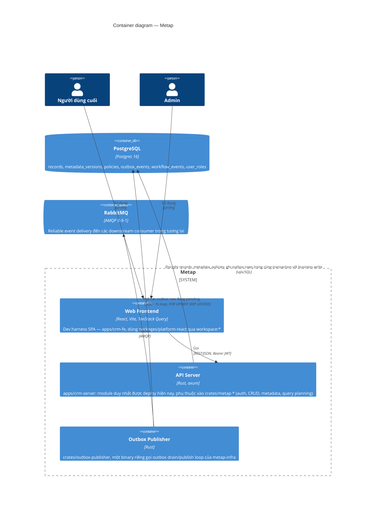
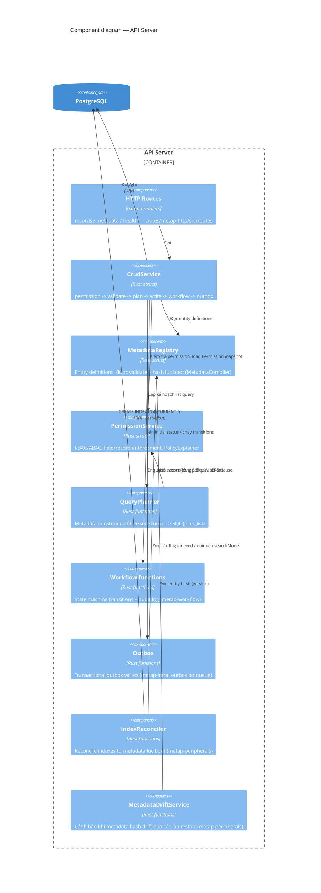
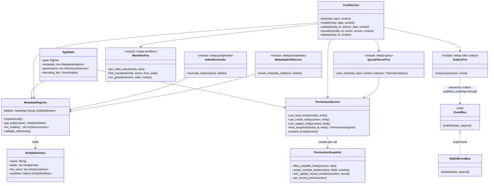
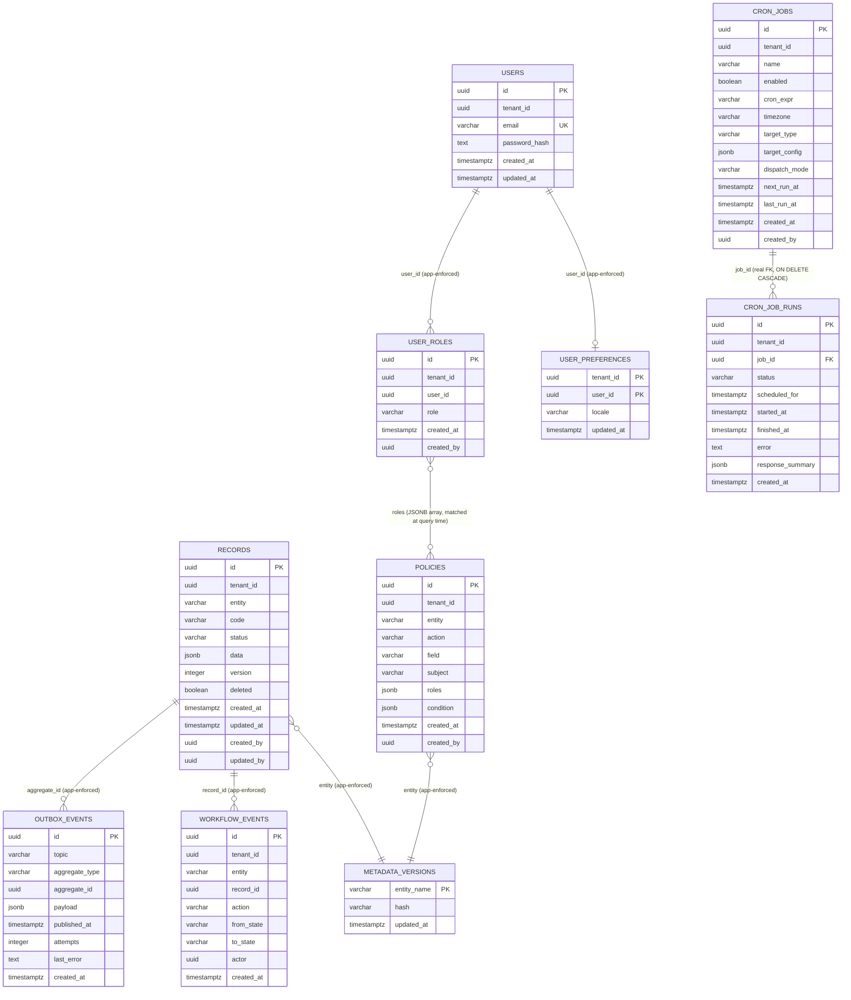

# 5. Building Block View

## Các layer cấp cao

```txt
axum routes (crates/metap-http/src/routes/*)
  -> application service (crates/metap-crud/src/crud_service.rs)
    -> platform core (metap-metadata / metap-permission / metap-query / metap-workflow)
      -> PostgreSQL (sqlx::PgPool, injected directly — no repository abstraction; see
         docs/architectures/09-adr.md for why)
      -> outbox (metap-infra::outbox::enqueue) -> RabbitMQ (metap-infra::EventBus)
```

## C4 Level 2: Containers



API Server và Outbox Publisher là hai process tách biệt một cách có chủ ý (`pnpm dev:rs` so với `pnpm worker:outbox:rs`) — khi RabbitMQ gặp sự cố, chỉ worker bị ngưng trệ, API không bị ảnh hưởng, vì transactional outbox write đã commit xong rồi. `apps/crm-server` có thể tùy chọn phục vụ luôn static files đã build của `apps/crm-fe` trên cùng process/port (`pnpm start`, cấu hình `STATIC_DIR`) — đây chỉ là một tiện lợi khi triển khai, không làm thay đổi sự tách biệt này; worker vẫn luôn là một process riêng biệt.

## C4 Level 3: Components (inside the API Server)



## Logical View (class-level)

Mô hình object đứng sau component diagram ở trên — các type và cách chúng phụ thuộc lẫn nhau, không phải các đơn vị deploy. (Logical View của Kruchten 4+1.) `metap-query`/`metap-workflow` là các function module chứ không phải struct (không có state cần giữ qua từng call), được thể hiện ở đây như pseudo-class để nhất quán với phần còn lại của diagram.



## Whitebox: Core Services

### Metadata Registry

Sở hữu các entity definition:

- fields
- list views
- workflow
- index/search/sort hints

Metap validate và compile metadata như một runtime artifact hạng nhất, thay vì coi nó là một mô tả schema thụ động. `MetadataCompiler` thực thi điều này tại thời điểm `MetadataRegistry::register()` — field trùng lặp, tham chiếu field/filter/sort của listView bị treo (dangling), giá trị enum thiếu, và workflow shape sai định dạng đều khiến quá trình khởi động thất bại, chứ không phải đợi đến request đầu tiên. Mỗi entity có một hash xác định (deterministic) cho hình dạng của nó (`MetadataCompiler::hash`, không tính guard condition), được expose dưới dạng `version` tại `GET /metadata/entities`; `MetadataDriftService` so sánh hash đó với hash được ghi nhận lần gần nhất mỗi khi boot và chỉ cảnh báo — không bao giờ crash — khi có drift, phản ánh đúng tinh thần graceful-degradation của health check. Cùng bản chiếu metadata an toàn đó cũng là nguồn cho tài liệu OpenAPI được sinh ra tại `GET /metadata/openapi.json` (viết tay trong `metap-metadata/src/openapi.rs`, được đồng bộ thủ công với các struct trong `entity.rs` — Rust không có bước runtime-reflection tương đương Zod).

### CRUD Service

CRUD tổng quát cho các metadata entity (`metap-crud::CrudService`), là thứ duy nhất mà routes gọi để thao tác trên record.

Trách nhiệm:

- validate dữ liệu bằng validator dẫn xuất từ field metadata (`metap-crud/src/validation.rs`, thay thế cho các Zod schema riêng theo từng entity — không có một object validation-schema viết tay riêng biệt)
- thực thi permission thông qua `PermissionService`
- gọi query planner (`metap-query::plan_list`) cho list/search
- lưu trữ record
- enqueue outbox event
- gọi các workflow function khi cần

### Permission Service

Lớp permission (`metap-permission::PermissionService`) sở hữu:

- tenant scope
- role assignment — động, lưu trong DB theo từng `(tenant_id, user_id)`, được grant/revoke ngay tại runtime qua HTTP API có bảo vệ admin (`crates/metap-http/src/routes/admin.rs`, bọc `metap-peripherals::assign_role`/`revoke_role`/`list_users`); bản thân JWT chỉ là một khẳng định danh tính trần trụi (bare identity assertion), không mang theo role
- policy storage — một allow-list theo role kết hợp với một attribute condition tùy chọn (`PolicyCondition`), các policy khớp được OR với nhau, không có deny rule, đứng sau trait `PolicyStore` (`PostgresPolicyStore` là implementation duy nhất hiện nay)
- field-level permission — che (mask) khi đọc và chặn khi ghi, được gắn vào mọi call site của `CrudService` (`list`/`create`/`update`/`transition`)
- record-level permission — attribute condition được dịch thành mệnh đề `WHERE` (`metap-query::condition_to_sql::record_policy_where_clause`) và AND vào `plan_list` khi đọc, cộng thêm một kiểm tra cùng hình dạng trước khi ghi
- giải thích/debug policy — `PolicyExplainer` tạo ra một trace chỉ-đọc của mọi policy đã được xét và lý do, được expose qua endpoint mô phỏng `POST /admin/policies/explain` có bảo vệ admin
- một `PermissionSnapshot` theo từng call gom các policy của một tenant/entity vào một lần fetch DB duy nhất, dùng lại xuyên suốt một lần gọi `CrudService` — cố ý không phải là cache theo kiểu cross-request/TTL

Ban đầu chỉ là một scaffold cho phép mọi thứ để kiến trúc có thể chạy được (trong codebase TS gốc); ranh giới service đã được cố định ngay từ đầu và logic thật sự ở trên giờ đã lấp đầy nó, được port lại 1:1 sang Rust.

### Query Planner

`metap-query::plan_list` biến các view/query contract an toàn thành SQL — đây là nơi *duy nhất* các query list/filter/sort được chuyển thành SQL.

Quy tắc:

- mọi list đều có giới hạn tối đa
- mọi business query đều bao gồm tenant scope
- frontend không thể gửi các toán tử truy vấn database tùy ý
- các field filter/sort phải được khai báo trong metadata
- các báo cáo tốn kém dùng report service riêng hoặc background job (hoãn lại, kích hoạt theo trigger — xem [11. Risks and Technical Debt](11-risks.md))

Xây dựng trên nền đó:

- **Hot field indexes.** `EntityField.indexed`/`unique` điều khiển `IndexReconciler` (`metap-peripherals`), tự động đồng bộ các partial expression index theo từng entity trên `records` lúc boot (`CREATE INDEX CONCURRENTLY IF NOT EXISTS`, best-effort) và qua một lệnh gọi thủ công tương đương `pnpm index:reconcile`. Biểu thức được index phải khớp byte-for-byte với biểu thức filter/sort của chính query đó (`jsonb_extract_path_text`, không phải toán tử `->>` tương đương về mặt ngữ nghĩa) nếu không Postgres sẽ không bao giờ chọn nó.
- **Full-text search.** `EntityField.searchMode: "fts"` (opt-in; mặc định vẫn là substring/ILIKE) khớp qua `to_tsvector('simple', ...) @@ plainto_tsquery('simple', ...)`, được hậu thuẫn bởi một GIN index — cùng cơ chế `IndexReconciler` như trên.
- **Keyset pagination.** Một cursor mờ (opaque), mã hóa base64 (`metap-query/src/cursor.rs`, client không bao giờ diễn giải nó) được validate theo sort *đã được resolve* (sau fallback) và chuyển thành điều kiện `WHERE` dạng keyset; một cursor dành cho sai sort, hoặc bị hỏng định dạng, sẽ trả về `400`, không bao giờ được chấp nhận âm thầm hay gây ra `500`.

### Workflow Functions

Workflow là metadata-driven (`metap-workflow`, các free function thay vì struct — không có state cần giữ qua từng call):

- state field
- initial state
- terminal states
- transitions
- actions

Transitions là các thao tác atomic có optimistic locking (một write bị lệch version sẽ làm request thất bại, chứ không phải làm sai state), được bảo vệ bởi một `PolicyCondition` — cùng hình dạng khai báo mà policy đã dùng (`metap-permission::PolicyCondition`), không phải một function, vì Rust không có khái niệm tương đương server-side-predicate-function để port từ thiết kế TS gốc (xem doc comment của `metap-metadata::entity::WorkflowTransition` để biết lý do). Mọi transition đều được ghi vào bảng audit append-only `workflow_events` và phát ra một outbox event `<entity>.workflow.transitioned` sau khi commit — side effect chỉ luôn đi qua outbox, không bao giờ publish trực tiếp.

### Outbox + EventBus

Các transaction của API ghi outbox row vào PostgreSQL (`metap-infra::outbox::enqueue`, cùng transaction với business write). Một publisher (`outbox-publisher`, một binary riêng) drain các row này và publish sang RabbitMQ thông qua trait `EventBus` (`metap-infra::EventBus`; `RabbitEventBus` là implementation duy nhất hiện nay) — việc publish nằm sau một interface (xem [09. Architecture Decisions](09-adr.md)).

Điều này bảo vệ hệ thống khỏi mất business event khi RabbitMQ tạm thời không khả dụng.

## Data Model

Metap bắt đầu với một bảng `records` tổng quát:

- các cột ổn định cho field ở cấp hệ thống
- `data jsonb` cho các business field dẫn xuất từ metadata
- các index theo tenant/entity/status
- cột version cho optimistic locking

Điều này giữ được tốc độ phát triển theo hướng metadata-driven. Theo thời gian, các module có khối lượng lớn hoặc quan trọng về mặt kế toán có thể được cấp bảng typed riêng trong khi vẫn dùng chung metadata facade.

Lộ trình phát triển đề xuất:

```txt
Step 1: generic records + JSONB (done)
Step 2: metadata-driven indexes for hot fields (done — see Query Planner
        above; shipped as per-entity partial expression indexes generated
        by IndexReconciler, not physical generated columns — a shared
        `records` table can't grow one column per possible field name
        across every entity without its column count growing unboundedly)
Step 3: dedicated tables for accounting/inventory critical paths
Step 4: report/materialized views for heavy analytics
```

Step 3-4 chưa được xây dựng và chưa có trigger nào kích hoạt — xem [11. Risks and Technical Debt](11-risks.md).

### Database Design (ER diagram)

Các bảng platform/ops (`crates/migrations/*.sql`, được apply qua `sqlx::migrate!` của `db-migrate`) — hầu hết không có ràng buộc foreign key liên bảng: `tenant_id`/`entity`/`aggregate_id`/`record_id` chỉ là các cột thường mà mối quan hệ của chúng được thực thi bởi application code (`QueryPlanner`, `CrudService`), không phải bởi database schema. Đây là chủ ý: `records` là một bảng tổng quát, entity-agnostic duy nhất, nên một FK thật từ ví dụ `workflow_events.record_id` sang `records.id` tuy hoạt động được ở hiện tại nhưng sẽ phải bị bỏ đi ngay khi có một entity bất kỳ được tách ra thành bảng riêng của nó (Step 3 ở trên) — không nên thêm vào trước khi trigger đó xảy ra. Ngoại lệ duy nhất: `cron_job_runs.job_id` có FK thật tới `cron_jobs.id` (`ON DELETE CASCADE`) — hai bảng này là cấu hình platform/ops thuần túy (giống `policies`/`user_roles`, không phải business entity), không nằm dưới ràng buộc "không FK" ở trên.



Ghi chú:

- `records.data` là payload dẫn xuất từ metadata; `code`/`status` là các cột top-level denormalized phản chiếu hai field bên trong `data` (`code` luôn luôn, `status` phản chiếu giá trị của `entity.workflow.stateField`) chỉ nhằm mục đích để chúng có thể được index/query như các cột thật.
- `outbox_events`/`workflow_events` tham chiếu tới các row của `records` theo id (`aggregate_id`/`record_id`) nhưng trên *toàn bộ* bảng tổng quát, không phải theo từng bảng riêng cho mỗi entity — một bảng outbox duy nhất phục vụ mọi entity.
- `policies.roles` là một mảng JSONB được đối chiếu với role của caller tại thời điểm đánh giá (`role_gate_passed`), không phải một relational join tới `user_roles`.
- `users` (Phase 15, local login) chỉ giữ danh tính (email + `password_hash` argon2id) — **không** giữ role. Role luôn nằm ở `user_roles`, tra mới cho mỗi request, không bao giờ cache trên JWT (xem sequence diagram "Tạo user, đăng nhập, kiểm tra quyền" ở [06. Runtime View](06-runtime.md)).
- Các index thật ngoài các primary key nêu trên được đề cập trong phần "Hot field indexes"/"Full-text search" ở trên — đó là các partial expression index theo từng entity được sinh ra từ metadata, không phải một phần của schema cố định này.

## Service Boundaries

Không để logic của HTTP, `sqlx`, RabbitMQ, và metadata rò rỉ khắp nơi.

Các phụ thuộc được phép:

```txt
routes -> services
services -> metadata / permission / query / workflow / outbox
metap-infra -> database / messaging
apps/crm-server -> crates/metap-* — never the other way around
```

Tránh:

- route/handler code import trực tiếp `sqlx`/`lapin`
- toán tử query từ frontend map trực tiếp sang SQL
- workflow handler publish RabbitMQ trực tiếp
- authorization chỉ tồn tại ở frontend hoặc cấu hình gateway

### Development View (workspace organization)

Cùng quy tắc phụ thuộc ở trên, được hình dung dưới dạng các thành viên workspace (Development View của Kruchten 4+1). Repo này chồng lấn hai hệ thống workspace tại `apps/`: một Cargo workspace (`Cargo.toml` ở gốc) cho backend, một pnpm workspace (`pnpm-workspace.yaml`) cho frontend — mỗi ô bên dưới là một package/crate thật với manifest riêng, không chỉ là một thư mục trong cây source.

```mermaid
graph TD
  subgraph cratesmetap["crates/metap-* (Cargo workspace members) — thư viện entity-agnostic"]
    infra["metap-infra<br/>db pool, EventBus trait, config, outbox enqueue"]
    metadata["metap-metadata<br/>EntityDefinition, MetadataCompiler, MetadataRegistry, OpenAPI gen"]
    permission["metap-permission<br/>PolicyStore, PermissionService, PolicyExplainer"]
    query["metap-query<br/>plan_list, cursor, condition-to-sql"]
    workflow["metap-workflow<br/>initial status, transitions, guards, audit"]
    crud["metap-crud<br/>CrudService: list/get/create/update/transition/delete"]
    http["metap-http<br/>axum router: /api/:entity*, /metadata/*, /health, JWT extractor<br/>build_router nhận extra_routes: Router&lt;AppState&gt; — không phụ thuộc lowcode(-http)"]
    peripherals["metap-peripherals<br/>index reconciler, drift check, role assignment"]
    lowcode["metap-lowcode<br/>draft/publish/rollback storage cho DB-authored entity (Phase 11)"]
    lowcodehttp["metap-lowcode-http<br/>/admin/lowcode/entities/* — crate riêng, opt-in qua extra_routes"]
  end

  subgraph opsbin["ops binaries (Cargo workspace members, built trên metap-*)"]
    outboxpub["outbox-publisher<br/>drain/publish worker loop"]
    dbmigrate["db-migrate<br/>sqlx::migrate! over crates/migrations"]
    devtools["dev-tools<br/>gen-keys / mint-token / seed-admin"]
  end

  subgraph appscrmserver["apps/crm-server (Cargo + pnpm member) — module duy nhất được deploy hiện nay"]
    customerentity["src/customer_entity.rs"]
    mainrs["src/main.rs<br/>inline wiring, boot sequence"]
  end

  subgraph pkgplatform["packages/platform-react (pnpm workspace member)"]
    platform["GeneratedList/Form, FieldValue/Input,<br/>WorkflowActionBar, RecordDetail, api-client"]
  end

  subgraph appscrmfe["apps/crm-fe (pnpm workspace member)"]
    demoapp["src/App.tsx, src/demo/*<br/>React + Vite + TanStack Query"]
  end

  http --> crud
  crud --> metadata
  crud --> permission
  crud --> query
  crud --> workflow
  crud --> infra
  lowcode --> metadata
  lowcodehttp --> lowcode
  lowcodehttp -.đọc/ghi AppState.metadata qua metap-http, không import ngược.-> http
  mainrs -->|"phụ thuộc vào"| http
  mainrs -->|"phụ thuộc vào"| infra
  mainrs -.opt-in: merge metap::lowcode_http::router vào build_router.-> lowcodehttp
  customerentity -.entity definition, không có business knowledge của metap-*.-> mainrs
  outboxpub --> infra
  dbmigrate --> infra
  devtools --> infra
  demoapp -->|"workspace:*"| platform
  demoapp -.chỉ qua HTTP, không bao giờ import Rust code.-> http
```

`apps/crm-server` phụ thuộc vào `crates/metap-*`; không có crate `metap-*` nào có đường phụ thuộc quay ngược lại `apps/crm-server` hay bất kỳ package `apps/*` nào khác — chính hướng phụ thuộc này giữ cho `metap-*` thực sự entity-agnostic, chứ không chỉ mang tính quy ước. `apps/crm-fe` là phần tương đương bên frontend: nó chỉ có thể tiếp cận backend qua HTTP (đường nét đứt), không bao giờ bằng cách import backend code, và nó dùng `packages/platform-react` theo cùng cách `apps/crm-server` dùng `crates/metap-*`.
