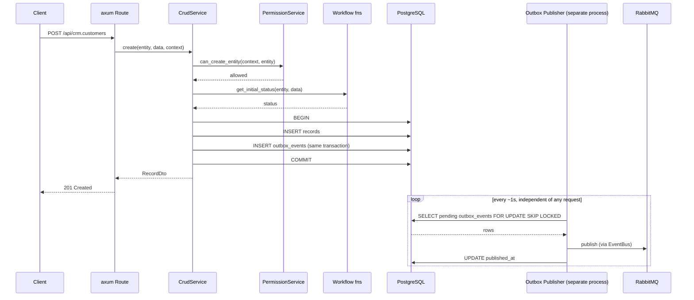

# 6. Runtime View

## Concurrency: hai process độc lập

API Server và Outbox Publisher chỉ kết nối với nhau qua PostgreSQL (transactional outbox) và RabbitMQ — không bao giờ gọi trực tiếp lẫn nhau. Sequence diagram bên dưới mô tả một request `create()` (process API Server) chạy song song với vòng lặp polling của Outbox Publisher (process riêng biệt). (Process View của Kruchten 4+1.)

Nếu RabbitMQ bị down, vòng lặp trên chỉ tiếp tục fail và retry — request `create()` đã commit và trả về xong trước khi vòng lặp đó chạy, nên tính khả dụng của API không bao giờ phụ thuộc vào việc RabbitMQ có đang chạy hay không.

## Scenarios

Các scenario dùng để kiểm chứng những building block ở trên, làm cơ sở cho các e2e test chạy trên DB thật của codebase này (`cargo test --workspace -- --ignored`, cần `DATABASE_URL` + một Postgres/RabbitMQ dev đang chạy). (Phần "+1" của Kruchten 4+1 — các scenario dùng để xác thực những view còn lại.)

- **Tạo một record** — `CrudService` → `PermissionService` → workflow fns → outbox `enqueue`, gói gọn trong một transaction PostgreSQL. Sequence: như trên.
- **Update với version đã lỗi thời** — cùng luồng như create, nhưng `WHERE version = $expected_version` của `CrudService::update` khớp 0 dòng, trả về `409 version_conflict` thay vì âm thầm ghi đè lên một write đang diễn ra đồng thời.
- **Workflow transition** — `find_transition` + `run_guard` (một phép đánh giá `PolicyCondition`) gác cổng cho việc đổi state; khi thành công, một dòng `workflow_events` dạng append-only được ghi và một outbox event `<entity>.workflow.transitioned` được enqueue trong cùng transaction với scenario create.
- **List có filter, full-text search, và keyset pagination** — thực thi toàn bộ `plan_list`: filter bị ràng buộc bởi metadata, nhánh `searchMode: "fts"`, mệnh đề `WHERE` của policy ở mức record, và một cursor được kiểm tra khớp với sort đã resolve — tất cả được AND lại thành một query duy nhất, chạy trên các index mà `IndexReconciler` duy trì.
- **Admin cấp một role** — `POST /admin/users/{userId}/roles` (chỉ admin mới gọi được, `crates/metap-http/src/routes/admin.rs`) ghi một dòng `user_roles` qua `metap_peripherals::assign_role`; request tiếp theo của user đó nhận role mới ngay lập tức (role luôn được đọc mới ở mỗi request, không bao giờ cache trong JWT).
