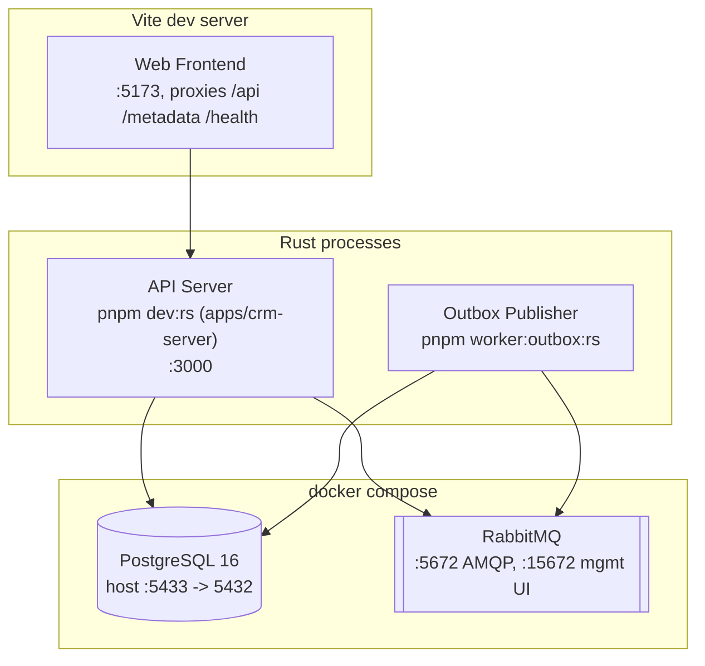

# 7. Deployment View

Topology triển khai cho local development (`docker compose` + các process Rust chạy qua wrapper script của `pnpm`, hoặc `cargo run` trực tiếp). Production chưa được xây dựng ([Phase 8: Hardening](../roadmap.md) đang tiến hành — đã có `Dockerfile` non-root và CI, nhưng chưa có topology triển khai production/orchestrator/secrets-manager thực sự) — tài liệu này phản ánh setup dev thực tế hiện tại, không phải một topology production mục tiêu. (Physical View của Kruchten 4+1.)

## Ghi chú

- API Server và Outbox Publisher hiện là hai binary/process riêng biệt, chưa phải hai container riêng — mỗi cái đều có thể được đóng container độc lập mà không cần sửa code, vì chúng vốn đã chỉ giao tiếp qua PostgreSQL/RabbitMQ.
- **Phương án chạy đơn process**: `pnpm start` build `apps/crm-fe` rồi trỏ config `STATIC_DIR` của `apps/crm-server` vào thư mục output build đó, để API server tự phục vụ luôn các static file của frontend, chạy đơn process/đơn port. Đây là một chế độ tiện lợi khi triển khai, không phải phương án thay thế cho workflow dev tách rời ở trên (`pnpm dev:web` + `pnpm dev:rs`) — Outbox Publisher không bao giờ bị gộp vào chế độ này, nó luôn là một process riêng biệt dù chạy theo cách nào.
- Chưa có tài liệu mô tả topology triển khai production — chưa có orchestrator (Kubernetes, ECS, v.v.), chưa có load balancer, chưa có autoscaling, chưa có secrets manager. Đây là khoản nợ kỹ thuật có thật, đã được ghi nhận — xem [11. Risks and Technical Debt](11-risks.md).
- `docker compose` ở đây chỉ là tiện ích cho local dev, không phải mục tiêu triển khai — `docker-compose.yml` chỉ chạy `postgres` và `rabbitmq`; API/worker/frontend đều chạy dưới dạng process thuần trên host.
