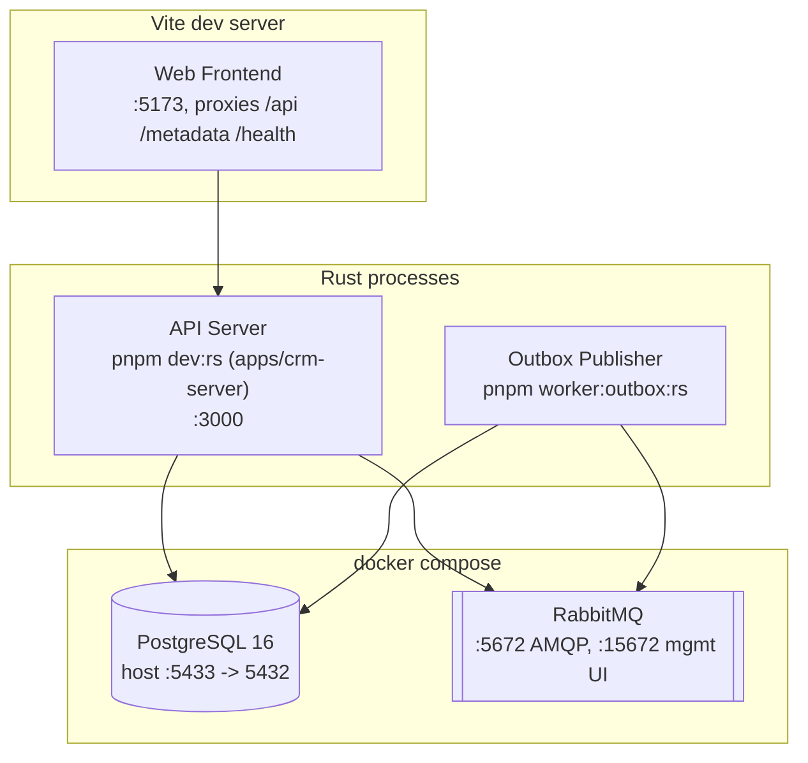

# 7. Deployment View

Topology triển khai cho local development (`docker compose` + các process Rust chạy qua wrapper script của `pnpm`, hoặc `cargo run` trực tiếp). Production chưa được xây dựng ([Phase 8: Hardening](../roadmap.md) đang tiến hành — đã có `Dockerfile` non-root và CI, nhưng chưa có topology triển khai production/orchestrator/secrets-manager thực sự) — tài liệu này phản ánh setup dev thực tế hiện tại, không phải một topology production mục tiêu. (Physical View của Kruchten 4+1.)

## Ghi chú

- API Server và Outbox Publisher hiện là hai binary/process riêng biệt, chưa phải hai container riêng — mỗi cái đều có thể được đóng container độc lập mà không cần sửa code, vì chúng vốn đã chỉ giao tiếp qua PostgreSQL/RabbitMQ.
- **Phương án chạy đơn process**: `pnpm start` build `apps/crm-fe` rồi trỏ config `STATIC_DIR` của `apps/crm-server` vào thư mục output build đó, để API server tự phục vụ luôn các static file của frontend, chạy đơn process/đơn port. Đây là một chế độ tiện lợi khi triển khai, không phải phương án thay thế cho workflow dev tách rời ở trên (`pnpm dev:web` + `pnpm dev:rs`) — Outbox Publisher không bao giờ bị gộp vào chế độ này, nó luôn là một process riêng biệt dù chạy theo cách nào.
- Chưa có tài liệu mô tả topology triển khai production — chưa có orchestrator (Kubernetes, ECS, v.v.), chưa có load balancer, chưa có autoscaling, chưa có secrets manager. Đây là khoản nợ kỹ thuật có thật, đã được ghi nhận — xem [11. Risks and Technical Debt](11-risks.md).
- `docker compose` ở đây chỉ là tiện ích cho local dev, không phải mục tiêu triển khai — `docker-compose.yml` chỉ chạy `postgres` và `rabbitmq`; API/worker/frontend đều chạy dưới dạng process thuần trên host.

### Secret manager — hướng thiết kế, chưa build (2026-08-17)

Chưa tích hợp secret manager thật vì chưa có target triển khai production nào được chốt
(self-host Vault? AWS/GCP secret manager của cloud provider nào?) — quyết định đó thuộc về
lúc chọn hạ tầng production thật, không phải thứ tự đoán trước được ở giai đoạn hiện tại
(đây là quyết định chỉ deployment target thật mới trả lời được, không phải việc code có thể tự
chọn hộ). Ghi lại hướng đi để không phải thiết kế lại từ đầu khi trigger đó xảy ra:

- `metap-control`'s `SecretStore` trait (`crates/metap-control/src/secret_store.rs`, xây cho
  Phase 16's `DedicatedDb` tenant strategy) đã đúng shape cần cho việc này: một
  `async fn db_credentials(&self, dsn_secret_ref: &str) -> anyhow::Result<DbCreds>` trả về
  `DbCreds{dsn: SecretString, expires_at: Option<Instant>}` — `expires_at` đã có sẵn chỗ cho
  dynamic/rotating credentials (vd Vault's leased DB credentials), dù `EnvStore` (impl duy nhất
  hôm nay) luôn trả `expires_at: None`. Một integration thật chỉ cần thêm một impl mới của
  cùng trait (`VaultStore`, `AwsSecretsManagerStore`, ...) — không cần đổi `Router` hay bất kỳ
  call site nào đang dùng `Arc<dyn SecretStore>`.
- Phạm vi rộng hơn `SecretStore` hiện tại: `AppConfig` (`metap-infra::config`) đọc
  `DATABASE_URL`/`RABBITMQ_URL`/đường dẫn JWT key trực tiếp từ biến môi trường (dotenv) lúc
  boot — đây là một cơ chế khác, tách biệt với `SecretStore` (vốn chỉ phục vụ việc `Router`
  resolve DSN của tenant `dedicated_db` lúc runtime, không phải config lúc boot của chính
  `crm-server`). Một integration secret-manager đầy đủ cần mở rộng để cả `AppConfig` cũng đọc
  qua cùng một abstraction, không chỉ riêng tenant DSN — đây là phần chưa thiết kế.
- Trigger để thực sự làm: khi một target triển khai production được chốt (xem đầu mục Ghi chú
  ở trên).
